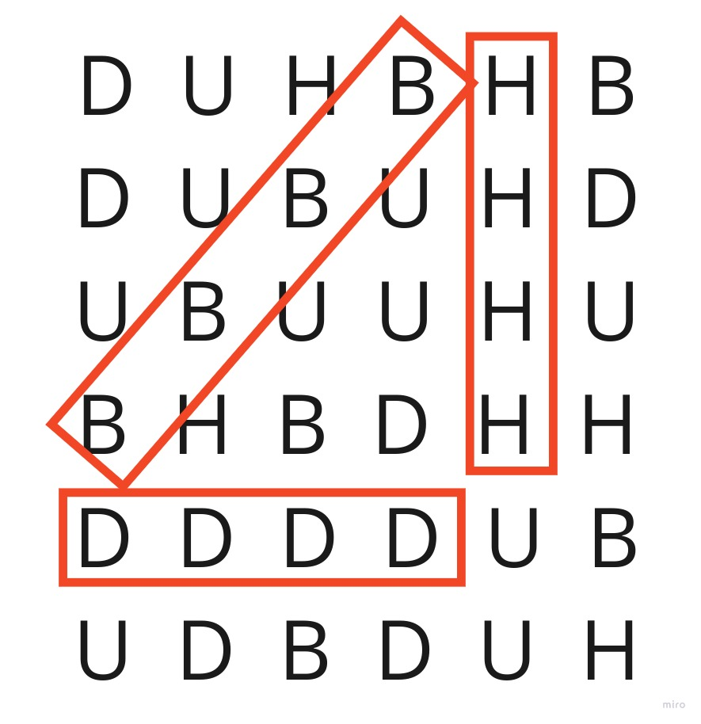
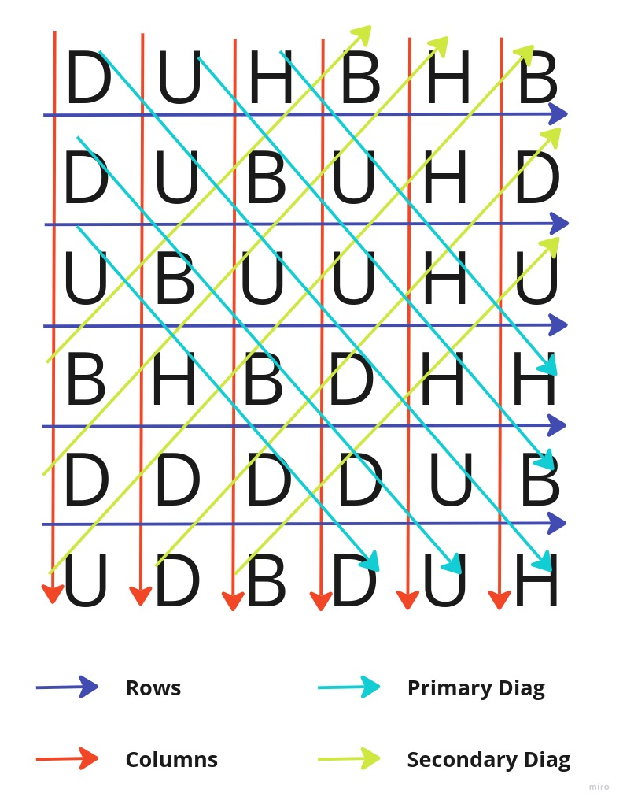

# Sequence Matrix Verifier

This application's purpose is to check if a sequence of strings (interpreted as an NxN matrix) given as input is valid or not.

## Running the application

First of all, be sure to have [Golang 1.19 or higher](https://go.dev/doc/install) and [Docker/Docker Compose](https://docs.docker.com/compose/install/) installed. It also might come in handy to be able to execute [Makefile](https://makefiletutorial.com/) commands.

Clone this repository locally and create an `.env` file with the same content as `.env.sample`.

> When terminating the aplication, remember to run `docker-compose down` or `make compose-down` to terminate the Docker dependencies gracefully.

### Via CLI

In the `.env` file, comment the line `MONGO_URI="mongodb://mongodb:27017/"` and uncomment `MONGO_URI="mongodb://localhost:27017/"`.

As the application stores data in MongoDB, we need to get it running. To do so, run the following command:

```sh
docker-compose up --build --d mongo mongo-admin
```

Alternatively, you can do the same using the Makefile:

```sh
make compose-up-mongo
```

Once MongoDB is up and running, we can start the application by running:

```sh
go run .
```

Or using the Makefile:

```sh
make run
```

And that's all! The server will be running on `localhost:9001` ready to receive requests.

### Via Docker Compose

In the `.env` file, comment the line `MONGO_URI="mongodb://localhost:27017/"` and uncomment `MONGO_URI="mongodb://mongodb:27017/"`.

Then build the `docker-compose.yaml` file:

```sh
docker-compose up --build --d
```

Alternatively, you can do the same using the Makefile:

```sh
make compose-up
```

And that's all! The server will be running on `localhost:9001` ready to receive requests.

## How it works

When executed, the application starts a server on `localhost:9001`, which provides the endpoint `/sequence`.
This endpoint expects a POST request with a JSON body in the given format:

```json
{
    "letters": ["DUHBHB", "DUBUHD", "UBUUHU", "BHBDHH", "DDDDUB", "UDBDUH"]
}
```

If the input is valid, it returns a JSON object containing the field `{ "is_valid": boolean }` to the user, and also stores this result in a MongoDB collection.

### Invalid inputs

If the input has one of the following characteristics it's considered invalid, and an error status code and message are returned:

- Input isn't a JSON object or doesn't contain the string array field `"letters"`.
- Some string in the `"letters"` array contains a character different than "B", "U", "D" or "H".
- The length of any item is different than the length of the array - **each string in the array represents a line in an NxN matrix, so these lengths must be the same**.
- The length is less than four. The reason for that is better explained in the next topic.

### Sequence validation

For a sequence to be considered valid, the NxN matrix that represents it must contain at least two sets of four letters repeated in a row, in any direction (vertical, horizontal or diagonal).

Example of a valid sequence:

```json
{
    "letters": ["DUHBHB", "DUBUHD", "UBUUHU", "BHBDHH", "DDDDUB", "UDBDUH"]
}
```



### Stats

Alongside with the `/sequence` endpoint, the server also provides another endpoint: `/stats`.
This endpoint expects a GET request with no body, and returns to the user some information about the previously analyzed sequences.

Response example:

```json
{
    "count_valid": 40,
    "count_invalid": 60,
    "ratio": 0.4
}
```

## How sequences are validated

As previously said, the string array which makes a sequence is interpreted as an NxN matrix. With this, the search for four repeated letters is made in four distinct directions of the matrix: rows, columns, primary diagonal and secondary diagonal:



It's important to notice two things:

- As the validation doesn't require the values in the matrix to be modified, each direction is independent, so the validation is done concurrently/in parallel for better performance.
- When validating, it looks for four or more repeated letters. Because of this, the first and last three lines of the primary and secondary diagonals are not considered (as these lines' length is less than four).

> Known issue: For matrices 9x9 or bigger, two repetitons in the same line are only counted once.  
> Example: "DDDDHDDDD" isn't enought for the sequence to be considered valid.
